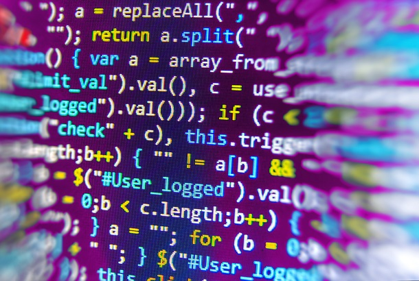

# [Link al repositorio](https://github.com/xanialinares17/1DAMP_LinaresGuirado_Xania.git)

# ¿Qué es un programa informático?
Un programa informático es un conjunto de instrucciones que sigue un ordenador para hacer una tarea. Se escriben en lenguajes de programación, como Python o Java, y pueden ir desde algo sencillo como una aplicación de calculadora hasta algo complejo como un sistema operativo

# Diferencias entre código fuente, código objeto y código ejecutable

- Código fuente: Es el escrito por el programador. La persona que lo escribe lo entiende, pero la máquina no lo entiende
- Código objeto: Es la traducción a un formato binario. El programador no lo entiende y todavía no es ejecutable
- Código ejecutable: Es el código final que el usuario abre y ejecuta sin necesidad de otras herramientas

# Etapas del desarrollo del software
## Las 7 etapas principales

- Planificación: Se definen los objetivos del proyecto y los plazos, junto con los recursos necesarios 
- Análisis: Se detectan las necesidades del usuario
- Diseño: Se planifica la interfaz, las bases de datos y los componentes del software  
- Desarrollo: Los/as programadores/as escriben el código fuente 
- Pruebas: Revisión del software para corregir errores
- Implementación: El programa se instala y los usuarios pueden probarlo
- Mantenimiento: Actualizaciones del programa. Es una fase continua